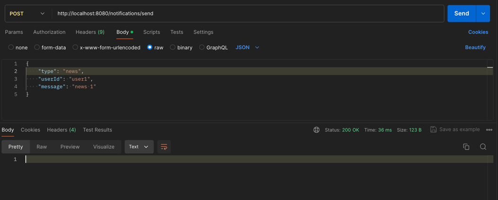
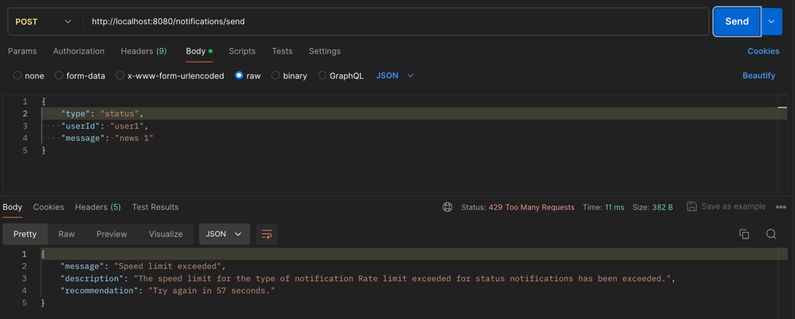
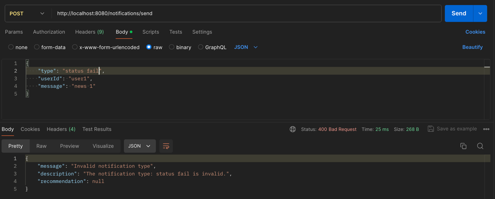

# Rate-Limited Notification Service

## Overview
This project implements a Notification Service with rate limiting to prevent abuse and ensure users do not receive excessive notifications. The service supports different types of notifications, each with its own rate limiting rules.

## Features
Rate Limiting: Limits the number of notifications sent per user based on the type of notification.
Notification Types: Supports various types such as Status, News, and Marketing.
Rate Limit Rules: Customizable rules for each notification type to prevent overloading.
Rate Limit Rules
The service enforces the following sample rate limits:
<b> Status</b> : No more than 2 per minute per recipient.
<b>News</b>: No more than 1 per day per recipient.
<b>Marketing</b>: No more than 3 per hour per recipient.
Getting Started

## Usage
Sending Notifications
To send a notification using the Notification Service, you can use the /notifications/send endpoint. This endpoint accepts a POST request with a JSON payload that specifies the notification details.

### Endpoint
<b>URL</b>: /notifications/send

<b>Method</b>: POST

<b>Content-Type</b>: application/json
### Request Body Example:
```
{
    "type": "status",
    "userId": "user1",
    "message": "news 1"
}
```

### Response:
<b>200 OK</b>: If the notification is sent successfully without text.

<b>429 Too Many Requests</b>: If the rate limit for the specified notification type has been exceeded.

<b>400 Bad Request Error</b>: For any other errors that occur during the processing of the request.


## Contact
If you have any questions, please reach out to cabreraemmanuellucas@hotmail.com.